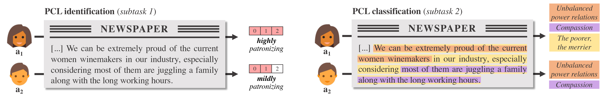
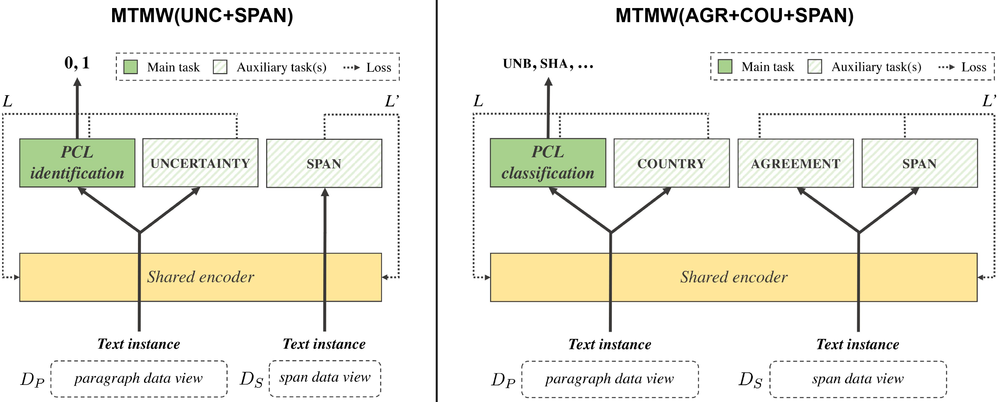

# Leveraging Annotators' Disagreement and Multiple Data Views for Patronizing Language Detection

[](LICENSE)
[](https://github.com/machamp-nlp/machamp)

This repository contains the code for the paper:

Alan Ramponi and Elisa Leonardelli. 2022. **DH-FBK at SemEval-2022 Task 4: Leveraging Annotators' Disagreement and Multiple Data Views for Patronizing Language Detection**. In *Proceedings of the 16th International Workshop on Semantic Evaluation (SemEval-2022)*. [[cite]](#citation) [[paper]](https://aclanthology.org/2022.semeval-1.42/)


## Background

The subtle and typically unconscious use of patronizing and condescending language (PCL) in large-audience media outlets feeds stereotypes and strengthens power-knowledge relationships, perpetuating discrimination towards vulnerable communities. Due to its subjective and subtle nature, **PCL detection is an open and challenging problem, both for computational methods and human annotators** [(Pérez-Almendros et al., 2020)](https://aclanthology.org/2020.coling-main.518/). 

Motivated by the subjectivity of human interpretation, we propose to **leverage annotators' uncertainty and disagreement** to better capture the shades of PCL in a multi-task, multi-view learning framework (see Fig. 1 for motivation). Our approach achieves competitive results at [SemEval-2022](https://semeval.github.io/SemEval2022/) Task 4 ([PCL detection in English media texts](https://sites.google.com/view/pcl-detection-semeval2022/home)) on both PCL identification (subtask 1) and PCL classification (subtask 2). Noticeably, our approach does not rely on any external data or model ensemble, making it a viable and attractive solution for real-world use.

<p align="center">
    
    <b>Fig. 1</b>: <i>Patronizing and condescending language is a subtle linguistic phenomenon that annotators (a1, a2) often perceive differently, and thus annotate in different ways.</i>
</p>


## Systems overview
Our approach is based on multi-task learning, a learning paradigm that aims to leverage training signals of related tasks at the same time by exploiting a shared representation in the model. In all our models, we employ a main task, namely PCL identification or classification, which is a task of direct interest. Additionally, we employ auxiliary tasks, namely tasks which can potentially improve the performance on the primary task. We also employ different forms (or views) of the original data, namely paragraph and span data views. See Fig. 2 for an overview.

<p align="center">
    
    <b>Fig. 2</b>: <i> Multi-task multi-view models (MTMW). Subtask 1 (left): main task is PCL identification and use uncertainty and span classification as auxiliaries. Subtask 2 (right): main task is PCL classification and use agreement, country and span classification as auxiliaries. Training is done on different data views (paragraphs and spans).</i>
</p>

For more details on methods, please read our paper (coming soon).


## Getting started

We built our models on top of [MaChAmp](https://github.com/machamp-nlp/machamp) v0.2, a multi-task learning toolkit for NLP which allows easy fine-tuning of contextualized embeddings and multi-dataset training. To get started, clone this repository on your own path.

### Environment

Create an environment with your own preferred package manager. We used [python 3.8](https://www.python.org/downloads/release/python-380/) and dependencies listed in [`requirements.txt`](requirements.txt). If you use [conda](https://docs.conda.io/en/latest/), you can just run the following commands from the root of the project:

```
conda create --name pcl python=3.8      # create the environment
conda activate pcl                      # activate the environment
pip install --user -r requirements.txt  # install the required packages
```

### Data

#### Get access to the dataset

Get the "Don't Patronize Me!" dataset, available upon formal request to data owners ([here](https://github.com/Perez-AlmendrosC/dontpatronizeme)). Then, extract the compressed archive and put the `dontpatronizeme_*.tsv` files on the `data/raw/` folder of the project. 

Train/dev split (IDs with associated labels) and the unlabeled test set (IDs with associated texts) have been made publicly available by data owners. Download and put them on the `data/raw/` folder too:
- train/dev splits (IDs and labels) [[train](https://github.com/Perez-AlmendrosC/dontpatronizeme/blob/master/semeval-2022/practice%20splits/train_semeval_parids-labels.csv), [dev](https://github.com/Perez-AlmendrosC/dontpatronizeme/blob/master/semeval-2022/practice%20splits/dev_semeval_parids-labels.csv)]
- test set for evaluation purposes [[test](https://github.com/Perez-AlmendrosC/dontpatronizeme/blob/master/semeval-2022/TEST/task4_test.tsv)]

Those files will be used to create both the paragraph and span data views used by our models.


#### Create paragraph and span data views

Our models use different views of the dataset (i.e., paragraph- and span-level PCL). To create corresponding data files in the MaChAmp format for the provided split, just run the following command from the project root:

```
python scripts/create_data_views.py
```

You will then find the paragraph data files (`paragraphs.train`, `paragraphs.dev`, and `paragraphs.test`) and span data files (`spans.train` and `spans.dev`) on the `data/` folder. Note that since the original test set is *unlabeled*, there is no way to know/obtain test spans (i.e., there is no `spans.test`). However, this is not an issue for our models since spans are actually used at training time only (to provide potentially useful training signals).


#### Create gold answer files for dev evaluation

Run the following command to create subtask 1 and subtask 2 gold dev answers files in the shared task format. Those files can then be found on the `data/dev_gold/` folder and will be used for evaluation.

```
python scripts/create_gold_dev_files.py
```


## Training

We use RoBERTa-base as encoder, and propose a multi-task, multi-view learning approach with dedicated decoders as detailed in our paper. MaChAmp's configuration files for proposed models are included on the [`configs/`](configs/) folder and used in commands below (i.e., `--dataset_config` for data/tasks; `--parameters_config` for model hyperparameters).

We provide commands to finetune our models (with names `--name`) for  subtask 1 and 2. If you do not have access to a GPU, you can use the CPU instead by setting `--device -1` (note: the finetuning process will be slower).

### Multi-task, multi-view PCL identification (subtask 1)

Finetune our proposed model for PCL identification, referred to as `MTMW(UNC+SPAN)` in our paper:

```
python train.py --dataset_config configs/t1.mtmw.uncertainty.json \
                --parameters_config configs/params.roberta-base.json \
                --name task1.mtmw.uncertainty \
                --device 0
```

The finetuned model will be created at `logs/task1.mtmw.uncertainty/$DATETIME/model.tar.gz`.

### Multi-task, multi-view PCL classification (subtask 2)

Finetune our proposed model for PCL classification, referred to as `MTMW(AGR+COU+SPAN)` in our paper:

```
python train.py --dataset_config configs/t2.mtmw.disagreement.country.json \
                --parameters_config configs/params.roberta-base.json \
                --name task2.mtmw.disagreement.country \
                --device 0
```

The finetuned model will be created at `logs/task2.mtmw.disagreement.country/$DATETIME/model.tar.gz`.

### Sequential PCL identification and classification (subtask 1 and 2)

Finetune our proposed model for both PCL identification and classification, referred to as `SEQ. FINE-TUNING` in our paper:

```
python train.py --dataset_configs configs/t1.mtmw.uncertainty.json configs/t2.mtmw.json \
                --parameters_config configs/params.roberta-base.json \
                --name task1n2.mtmw.sequential \
                --sequential \
                --device 0
```

The finetuned model will be created at `logs/task1n2.mtmw.sequential.1/$DATETIME/model.tar.gz`.


## Inference

Once a model has been finetuned (see [Training](#training) section), you can use it to predict patronizing and condescending language on the unlabeled test set (`data/paragraphs.test`). You just need to run the command(s) from below which correspond(s) to the model variant(s) you previously finetuned.

### Multi-task, multi-view PCL identification (subtask 1)

The predict script uses the `MTMW(UNC+SPAN)` model (first parameter) to predict labels on the test set `data/paragraphs.test` (second parameter), then writing predictions on a `.txt` file (third parameter):

```
python predict.py logs/task1.mtmw.uncertainty/$DATETIME/model.tar.gz \
                  data/paragraphs.test \
                  logs/task1.mtmw.uncertainty/$DATETIME/task1-test-pred.txt \
                  --dataset PARlabels \
                  --device 0
```

Predicting with multi-view models needs a (fourth) `--dataset` parameter, whose value is the name of the desired dataset/task for prediction as indicated in the `--dataset_configs` training configuration file (i.e., `PARlabels`).

You will find predictions on `logs/task1.mtmw.uncertainty/$DATETIME/task1-test-pred.txt`.

### Multi-task, multi-view PCL classification (subtask 2)

The predict script uses the `MTMW(AGR+COU+SPAN)` model (first parameter) to predict labels on the test set `data/paragraphs.test` (second parameter), then writing predictions on a `.txt` file (third parameter):

```
python predict.py logs/task2.mtmw.disagreement.country/$DATETIME/model.tar.gz \
                  data/paragraphs.test \
                  logs/task2.mtmw.disagreement.country/$DATETIME/task2-test-pred.txt \
                  --dataset PARlabels \
                  --device 0
```

Predicting with multi-view models needs a (fourth) `--dataset` parameter, whose value is the name of the desired dataset/task for prediction as indicated in the `--dataset_configs` training configuration file (i.e., `PARlabels`).

You will find predictions on `logs/task2.mtmw.disagreement.country/$DATETIME/task2-test-pred.txt`.

### Sequential PCL identification and classification (subtask 1 and 2)

The predict script uses the `SEQ. FINE-TUNING` model (first parameter) to predict labels on the test set `data/paragraphs.test` (second parameter), then writing predictions on a `.txt` file (third parameter):

```
python predict.py logs/task1n2.mtmw.sequential.1/$DATETIME/model.tar.gz \
                  data/paragraphs.test \
                  logs/task1n2.mtmw.sequential.1/$DATETIME/task2-test-pred.txt \
                  --dataset PARlabels \
                  --device 0
```

Predicting with multi-view models needs a (fourth) `--dataset` parameter, whose value is the name of the desired dataset/task for prediction as indicated in the `--dataset_configs` training configuration file (i.e., `PARlabels`).

You will find predictions on `logs/task1n2.mtmw.sequential/$DATETIME/task2-test-pred.txt`.


## Evaluation on dev data

Predictions on the development set are automatically written on the `PARlabels.dev.out` file in the output log folder when fine-tuning. To get performance scores on development data according to the official shared task evaluation metrics, you just need to convert predictions to a numeric format and run the official scorer as follows:

```
# Convert MaChAmp-formatted predictions to the shared task numerical format
python scripts/convert_predictions.py -I $PRED_FILEPATH -O $OUTPUT_FOLDER -T $TASK

# Run the shared task scorer
python scripts/evaluate_predictions.py $OUTPUT_FOLDER $GOLD_FOLDER
```

where:
- `$PRED_FILEPATH`: the filepath of predictions on the dev set (i.e., path to the `PARlabels.dev.out` file)
- `$OUTPUT_FOLDER`: the folder where to write predictions in a numeric format and scores
- `$GOLD_FOLDER`: the folder where gold `task1.txt` and `task2.txt` dev files are located
- `$TASK` (choices: [`task1`, `task2`, `all`]): the task tackled by the model which created the prediction file
  - namely, `MTMW(UNC+SPAN)`->`task1`; `MTMW(AGR+COU+SPAN)`->`task2`; `SEQ. FINE-TUNING`->`all`

You will find a `scores.txt` file with scores on the `$OUTPUT_FOLDER` folder you defined above.


## Additional information

### Can I use your model(s) to detect PCL on my own data? How can I do it?

Absolutely, you can - and we would be happy to know it! To predict PCL on your own data, you have to change the second parameter of the `predict.py` command (i.e., `data/paragraphs.test`) to your own data filepath. Your data must follow the same tab-separated format of `data/paragraphs.test`.

Note: be aware that our models are trained on **news** paragraphs in **English** language. As such, they follow the assumption of supervised machine learning, i.e., they are expected to be applied on data drawn from a similar linguistic distribution.

### Why scores are zeros when doing inference on test data?

Note that test labels have not been released by data authors, and thus the test portion is completely *unlabeled*. There is no way to know actual test scores without submitting predictions to the [official CodaLab competition page](https://competitions.codalab.org/competitions/34344#learn_the_details-overview). Nevertheless, we submit them ourselves during the competition, and you can find scores on the paper.

If you need to evaluate your own models by building on our work, you can (*and should!*) use the dev data portion.

### How can I reproduce the official SemEval test evaluation scores?

Since test data labels have not been publicly distributed by shared task organizers, to reproduce official test scores for our models you would need to upload CodaLab-formatted predictions as detailed on the [official CodaLab competition page](https://competitions.codalab.org/competitions/34344#learn_the_details-overview).


## Citation

If you use or build on top of this work, please cite our paper as follows:

```
@inproceedings{ramponi-leonardelli-2022-dh,
    title = "{DH}-{FBK} at {S}em{E}val-2022 Task 4: Leveraging Annotators{'} Disagreement and Multiple Data Views for Patronizing Language Detection",
    author = "Ramponi, Alan and Leonardelli, Elisa",
    booktitle = "Proceedings of the 16th International Workshop on Semantic Evaluation (SemEval-2022)",
    month = jul,
    year = "2022",
    address = "Seattle, United States",
    publisher = "Association for Computational Linguistics",
    url = "https://aclanthology.org/2022.semeval-1.42",
    doi = "10.18653/v1/2022.semeval-1.42",
    pages = "324--334"
}
```
